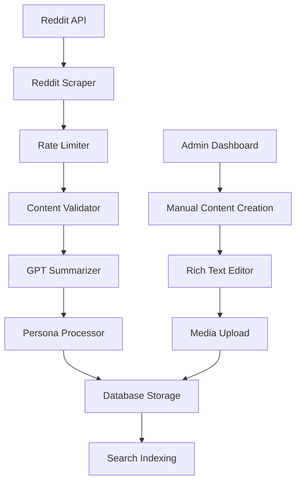
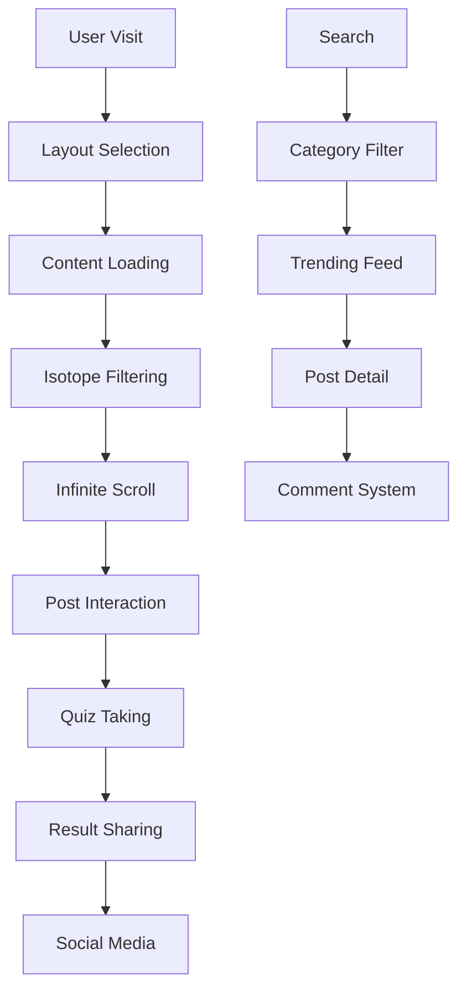
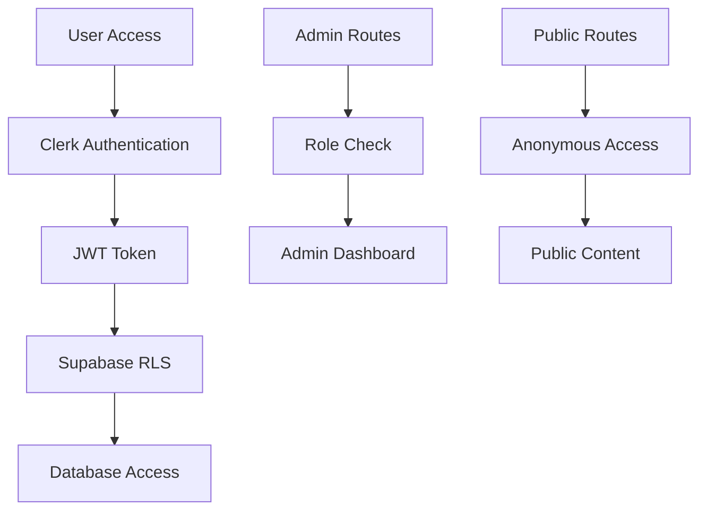

# System Architecture

## Overview

ThreadJuice is a Next.js 15 application that transforms viral Reddit content into engaging, persona-driven articles with interactive quizzes. The system integrates the Sarsa Next.js template for professional news/magazine UI components and layouts.

## Technology Stack

### Frontend (Sarsa-Enhanced)

- **Framework**: Next.js 15 (App Router)
- **UI Template**: Sarsa Next.js v2.0 (News & Magazine Template)
- **Styling**: Tailwind CSS + Sarsa SCSS + Bootstrap 5
- **Authentication**: Clerk
- **State Management**: React Query + Zustand
- **Animations**: WOW.js, Swiper, React Fast Marquee, Typewriter Effect
- **Grid System**: Isotope Layout for filtering and sorting
- **Components**: React 18 with TypeScript

### Backend

- **Database**: Supabase (PostgreSQL)
- **File Storage**: Supabase Storage
- **API Routes**: Next.js App Router API
- **Authentication**: Clerk (integrated with Supabase RLS)
- **Validation**: Zod schemas
- **Rate Limiting**: Custom rate limiter with Redis

### External APIs

- **Reddit API**: OAuth2 authentication, content scraping
- **OpenAI API**: gpt-4o for content summarization and quiz generation
- **Image APIs**: Wikimedia Commons, Unsplash (Creative Commons)

### Infrastructure

- **Hosting**: Vercel
- **Database**: Supabase Cloud
- **CDN**: Vercel Edge Network
- **Monitoring**: Vercel Analytics + Sentry
- **CI/CD**: GitHub Actions

## Frontend Architecture (Sarsa Integration)

### Layout System

```
components/layout/
├── Layout.tsx              # Main layout controller with Sarsa integration
├── Header/
│   ├── Header1.tsx         # Main news layout
│   ├── Header2.tsx         # Magazine style
│   ├── Header3.tsx         # Minimal layout
│   ├── Header4.tsx         # Tech-focused
│   ├── Header5.tsx         # Social media style
│   ├── Header6.tsx         # Fashion/lifestyle
│   └── Header7.tsx         # Adventure/travel
├── Footer/
│   ├── Footer1.tsx         # Standard footer
│   ├── Footer2.tsx         # Minimal footer
│   └── Footer3.tsx         # Extended footer
├── Breadcrumb.tsx          # Navigation breadcrumbs
└── PageHead.tsx            # SEO and meta tags
```

### UI Component Hierarchy

```
components/
├── ui/                     # Core UI components (Sarsa-styled)
│   ├── PostCard.tsx        # News-style post cards
│   ├── PersonaBadge.tsx    # Author badges
│   ├── ShareBar.tsx        # Social sharing
│   ├── CategoryBadge.tsx   # Content categories
│   ├── TrendingBadge.tsx   # Viral indicators
│   └── LoadingSpinner.tsx  # Animated loading
├── features/               # Feature components
│   ├── TrendingFeed.tsx    # Magazine-style feed
│   ├── CategoryFilter.tsx  # Isotope filtering
│   ├── Quiz.tsx            # Interactive quizzes
│   ├── PostDetail.tsx      # Article layout
│   └── CommentScreenshot.tsx # Reddit comments
├── slider/                 # Carousel components
│   ├── FeaturedCarousel.tsx # Hero section
│   ├── PostSlider.tsx      # Post carousel
│   └── TrendingMarquee.tsx # Scrolling topics
├── sidebar/                # Sidebar widgets
│   ├── PopularPosts.tsx    # Popular content
│   ├── CategoryList.tsx    # Category navigation
│   ├── NewsletterSignup.tsx # Email subscription
│   └── SocialFollow.tsx    # Social media links
└── elements/               # Animation wrappers
    ├── WowAnimation.tsx    # WOW.js wrapper
    ├── TypewriterText.tsx  # Typewriter effects
    └── BackToTop.tsx       # Scroll to top
```

### Page Structure (Sarsa Layouts)

```
app/
├── page.tsx                # Homepage (Header1 + Featured Carousel)
├── posts/
│   └── [slug]/page.tsx     # Article layout (Header3 + Sidebar)
├── category/
│   └── [category]/page.tsx # Archive layout (Header2 + Grid)
├── (auth)/
│   └── dashboard/page.tsx  # Admin layout (Header4)
└── about/page.tsx          # Minimal layout (Header3)
```

## Data Flow Architecture

### Content Ingestion Pipeline



### User Interaction Flow



## Database Schema

### Core Tables

```sql
-- Posts table with Sarsa layout support
CREATE TABLE posts (
  id UUID PRIMARY KEY DEFAULT gen_random_uuid(),
  title TEXT NOT NULL,
  slug TEXT UNIQUE NOT NULL,
  hook TEXT NOT NULL,
  content JSONB NOT NULL,
  persona_id INTEGER REFERENCES personas(id),
  status post_status DEFAULT 'draft',
  category TEXT,
  layout_style INTEGER DEFAULT 1, -- Sarsa layout variant
  featured BOOLEAN DEFAULT false,
  trending_score INTEGER DEFAULT 0,
  view_count INTEGER DEFAULT 0,
  share_count INTEGER DEFAULT 0,
  event_id UUID REFERENCES events(id),
  reddit_thread_id TEXT,
  subreddit TEXT,
  created_at TIMESTAMPTZ DEFAULT NOW(),
  updated_at TIMESTAMPTZ DEFAULT NOW()
);

-- Enhanced personas for different content styles
CREATE TABLE personas (
  id SERIAL PRIMARY KEY,
  name TEXT NOT NULL,
  avatar_url TEXT,
  tone TEXT NOT NULL,
  style_preferences JSONB, -- Sarsa layout preferences
  target_audience TEXT,
  content_focus TEXT[]
);

-- Categories for Isotope filtering
CREATE TABLE categories (
  id SERIAL PRIMARY KEY,
  name TEXT NOT NULL,
  slug TEXT UNIQUE NOT NULL,
  description TEXT,
  color TEXT,
  icon TEXT,
  post_count INTEGER DEFAULT 0
);

-- Enhanced comments with threading
CREATE TABLE comments (
  id UUID PRIMARY KEY DEFAULT gen_random_uuid(),
  post_id UUID REFERENCES posts(id) ON DELETE CASCADE,
  parent_id UUID REFERENCES comments(id),
  author TEXT NOT NULL,
  body TEXT NOT NULL,
  score INTEGER DEFAULT 0,
  sentiment JSONB,
  reddit_comment_id TEXT,
  thread_level INTEGER DEFAULT 0,
  created_at TIMESTAMPTZ DEFAULT NOW()
);

-- Quiz system
CREATE TABLE quizzes (
  id UUID PRIMARY KEY DEFAULT gen_random_uuid(),
  post_id UUID REFERENCES posts(id) ON DELETE CASCADE,
  title TEXT NOT NULL,
  questions JSONB NOT NULL,
  completion_count INTEGER DEFAULT 0,
  average_score DECIMAL(3,2),
  created_at TIMESTAMPTZ DEFAULT NOW()
);

-- User interactions and analytics
CREATE TABLE user_interactions (
  id UUID PRIMARY KEY DEFAULT gen_random_uuid(),
  user_id TEXT NOT NULL, -- Clerk user ID
  post_id UUID REFERENCES posts(id),
  interaction_type TEXT NOT NULL, -- view, share, quiz_complete, etc.
  metadata JSONB,
  created_at TIMESTAMPTZ DEFAULT NOW()
);
```

## API Architecture

### REST API Endpoints

```typescript
// Core content endpoints
GET    /api/posts                    # List posts with filtering
POST   /api/posts                    # Create new post
GET    /api/posts/[id]               # Get single post
PUT    /api/posts/[id]               # Update post
DELETE /api/posts/[id]               # Delete post

// Category and filtering
GET    /api/categories               # List all categories
GET    /api/categories/[slug]/posts  # Posts by category
GET    /api/trending                 # Trending posts
GET    /api/featured                 # Featured posts

// Quiz system
GET    /api/quizzes/[id]             # Get quiz
POST   /api/quizzes/[id]/submit      # Submit quiz answers
GET    /api/quizzes/[id]/results     # Get quiz results

// Content ingestion
POST   /api/ingest/reddit            # Trigger Reddit ingestion
GET    /api/ingest/status/[jobId]    # Check ingestion status
POST   /api/ingest/manual            # Manual content creation

// User interactions
POST   /api/interactions             # Track user interactions
GET    /api/analytics/posts/[id]     # Post analytics
GET    /api/analytics/dashboard      # Admin dashboard data

// Media management
POST   /api/media/upload             # Upload media files
GET    /api/media/[id]               # Get media file
DELETE /api/media/[id]               # Delete media file
```

### Authentication Flow



## Component Integration Strategy

### Sarsa Template Adaptation

1. **Layout System**: Adapt Sarsa's multiple header/footer variants for different content types
2. **Component Library**: Extract and enhance Sarsa UI components with TypeScript
3. **Animation Integration**: Integrate WOW.js, Swiper, and Marquee animations
4. **Responsive Design**: Maintain Sarsa's Bootstrap 5 responsive patterns
5. **Dark Mode**: Implement Sarsa's dark mode toggle functionality

### State Management

```typescript
// Global state with Zustand
interface AppState {
  // UI state
  darkMode: boolean;
  sidebarOpen: boolean;
  currentLayout: number;

  // Content state
  posts: Post[];
  categories: Category[];
  currentCategory: string;

  // User state
  user: User | null;
  preferences: UserPreferences;
}

// React Query for server state
const queryClient = new QueryClient({
  defaultOptions: {
    queries: {
      staleTime: 5 * 60 * 1000, // 5 minutes
      cacheTime: 10 * 60 * 1000, // 10 minutes
    },
  },
});
```

## Performance Optimization

### Frontend Optimization

- **Code Splitting**: Dynamic imports for Sarsa components
- **Image Optimization**: Next.js Image component with Sarsa styling
- **Bundle Analysis**: Webpack Bundle Analyzer for size optimization
- **Lazy Loading**: Intersection Observer for content loading
- **Animation Performance**: GPU-accelerated CSS animations

### Backend Optimization

- **Database Indexing**: Optimized indexes for common queries
- **Caching Strategy**: Redis for API response caching
- **Rate Limiting**: Prevent API abuse and ensure fair usage
- **Connection Pooling**: Supabase connection optimization

### SEO and Meta Tags

```typescript
// Enhanced metadata generation
export function generateMetadata({ params }: { params: { slug: string } }) {
  return {
    title: `${post.title} | ThreadJuice`,
    description: post.hook,
    openGraph: {
      title: post.title,
      description: post.hook,
      images: [post.featuredImage],
      type: 'article',
    },
    twitter: {
      card: 'summary_large_image',
      title: post.title,
      description: post.hook,
      images: [post.featuredImage],
    },
  };
}
```

## Security Architecture

### Authentication & Authorization

- **Clerk Integration**: Secure user authentication
- **Row Level Security**: Supabase RLS for data protection
- **API Route Protection**: Middleware for protected endpoints
- **CSRF Protection**: Built-in Next.js CSRF protection

### Data Validation

- **Zod Schemas**: Runtime type validation for all API inputs
- **Content Sanitization**: XSS prevention for user-generated content
- **Rate Limiting**: Prevent abuse and ensure service availability
- **Environment Variables**: Secure configuration management

## Monitoring and Analytics

### Application Monitoring

- **Vercel Analytics**: Performance and usage metrics
- **Sentry**: Error tracking and performance monitoring
- **Custom Analytics**: User interaction tracking
- **Database Monitoring**: Supabase built-in monitoring

### Business Metrics

- **Content Performance**: Views, shares, engagement rates
- **Quiz Analytics**: Completion rates, average scores
- **User Behavior**: Navigation patterns, time on site
- **Conversion Tracking**: Newsletter signups, social follows

This architecture provides a scalable, maintainable foundation for ThreadJuice while leveraging the professional UI components and layouts from the Sarsa template to create an engaging news and magazine experience.
